# Разработка транслятора

## **Задача** 
На основании базового описания языка разработать транслятор. Базовое описание языка имеет следующий вид:

```EBNF
- <S> ::= <program>
- <program> ::= <variable_declaration><description_calculations>
- <description_calculations> ::= BEGIN <list_actions> END
- <list_actions> ::= <list_assignments>
- <list_actions> ::= <list_assignments><list_actions>
- <list_actions> ::= <list_operators>
- <list_actions> ::= <list_operators><list_actions>
- <variable_declaration> ::= VAR <list_variables> : LOGICAL ;
- <list_variables> ::= id
- <list_variables> ::= id , <list_variables>
- <list_operators> ::= <operator>
- <list_operators> ::= <operator><list_operators>
- <operator> ::= READ ( <list_variables> ) ;
- <operator> ::= WRITE ( <list_variables> ) ;
- <operator> ::= IF ( <expr> ) THEN <description_calculations> ELSE <description_calculations> END_IF
- <list_assignments> ::= <assignment>
- <list_assignments> ::= <assignment><list_assignments>
- <assignment> ::= id = <expr> ;
- <expr> ::= <unary_op><sub_expr>
- <expr> ::= <sub_expr>
- <sub_expr> ::= ( <expr> )
- <sub_expr> ::= <operand>
- <sub_expr> ::= <sub_expr><bin_op><sub_expr>
- <unary_op> ::= NOT
- <bin_op> ::= AND
- <bin_op> ::= OR
- <bin_op> ::= EQU
- <operand> ::= id
- <operand> ::= const
```

<br/>

**id** - Идентификатор переменной, который состоит только из латинских букв в нижнем регистре, его длина не может превосходить 11 символов.  
**const** - Число 0 или 1 (false/true)

---
<br/>

## Полезные ссылки
1. [ЯЗЫКИ ПРОГРАММИРОВАНИЯ И МЕТОДЫ ТРАНСЛЯЦИИ (О.В. Молдованова)](https://docs.yandex.ru/docs/view?tm=1665083277&tld=ru&lang=ru&name=LanguagesAndTranslationMethods.pdf&text=теория%20языков%20программирования%20и%20методы%20трансляции&url=https%3A%2F%2Fita.sibsutis.ru%2Fsites%2Fcsc.sibsutis.ru%2Ffiles%2Fcourses%2Ftrans%2FLanguagesAndTranslationMethods.pdf&lr=49&mime=pdf&l10n=ru&sign=4a7cca14f1e0bd6ee25ca35a1cb846e8&keyno=0&nosw=1&serpParams=tm%3D1665083277%26tld%3Dru%26lang%3Dru%26name%3DLanguagesAndTranslationMethods.pdf%26text%3D%25D1%2582%25D0%25B5%25D0%25BE%25D1%2580%25D0%25B8%25D1%258F%2B%25D1%258F%25D0%25B7%25D1%258B%25D0%25BA%25D0%25BE%25D0%25B2%2B%25D0%25BF%25D1%2580%25D0%25BE%25D0%25B3%25D1%2580%25D0%25B0%25D0%25BC%25D0%25BC%25D0%25B8%25D1%2580%25D0%25BE%25D0%25B2%25D0%25B0%25D0%25BD%25D0%25B8%25D1%258F%2B%25D0%25B8%2B%25D0%25BC%25D0%25B5%25D1%2582%25D0%25BE%25D0%25B4%25D1%258B%2B%25D1%2582%25D1%2580%25D0%25B0%25D0%25BD%25D1%2581%25D0%25BB%25D1%258F%25D1%2586%25D0%25B8%25D0%25B8%26url%3Dhttps%253A%2F%2Fita.sibsutis.ru%2Fsites%2Fcsc.sibsutis.ru%2Ffiles%2Fcourses%2Ftrans%2FLanguagesAndTranslationMethods.pdf%26lr%3D49%26mime%3Dpdf%26l10n%3Dru%26sign%3D4a7cca14f1e0bd6ee25ca35a1cb846e8%26keyno%3D0%26nosw%3D1)
2. [лекции на гитхабе](https://github.com/Ollisteka/lectures)
3. [Статья на хабре (Написание компилятора LALR(1)-парсеров. Описание LR-генераторов)](https://habr.com/ru/articles/140339/)
4. [Еще одна статья на хабре (Пишем LR(0)-анализатор. Простыми словами о сложном)](https://habr.com/ru/articles/116732/)
5. [Лекции на интуите](https://intuit.ru/studies/courses/1157/173/lecture/4697?page=7)
6. [Восходящие анализаторы](https://docs.yandex.ru/docs/view?tm=1667673599&tld=ru&lang=ru&name=bottom-up-parser.pdf&text=lr%20РАСПОЗНАВАТЕЛЬ&url=http%3A%2F%2Flab314.brsu.by%2Fkmp-lite%2Fkmp2%2FJOB%2FNLP-Tomita%2Fbottom-up-parser.pdf&lr=49&mime=pdf&l10n=ru&sign=4911689781f577379a5d7902277a27c9&keyno=0&nosw=1&serpParams=tm%3D1667673599%26tld%3Dru%26lang%3Dru%26name%3Dbottom-up-parser.pdf%26text%3Dlr%2B%25D0%25A0%25D0%2590%25D0%25A1%25D0%259F%25D0%259E%25D0%2597%25D0%259D%25D0%2590%25D0%2592%25D0%2590%25D0%25A2%25D0%2595%25D0%259B%25D0%25AC%26url%3Dhttp%253A%2F%2Flab314.brsu.by%2Fkmp-lite%2Fkmp2%2FJOB%2FNLP-Tomita%2Fbottom-up-parser.pdf%26lr%3D49%26mime%3Dpdf%26l10n%3Dru%26sign%3D4911689781f577379a5d7902277a27c9%26keyno%3D0%26nosw%3D1)

<br/>

---

<br/>

## Древовидная структура программы

### Пример одного из узлов получившегося дерева (CST)
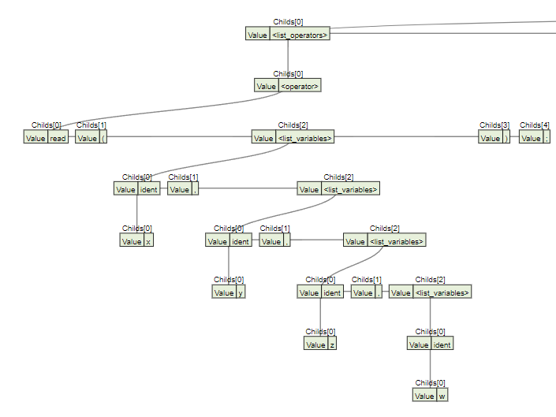

### Преобразованная часть (AST)
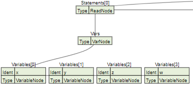

---

<br/>

## Примеры программ

**1. Корректная программа с условием**  
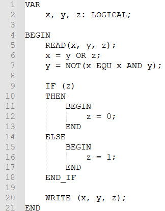  

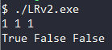

```
x, y, z = 1, 1, 1  
x = 1 OR 1 = 1  
y = NOT(1 == 1 && 1) = 0  
z = 0  
True False False  
```

<br/>

**2. Корректная программа с учетом приоритета операций**  
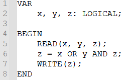

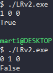

```
x, y, z = 1, 0, 0
z = 1 || 0 && 0 = 1
True
```
```
x, y, z = 0, 1, 0
z = 0 || 1 && 0 = 0
False
```

<br/>

**3. Корректная программа, но с некорректным вводом**  


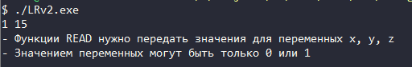

<br/>

**4. Некорректная программа, имя переменной должна состоять только из букв**  
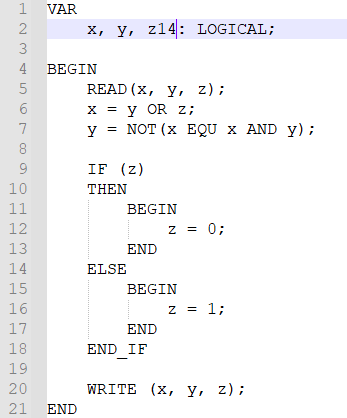

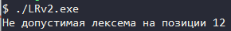

<br/>

**5. Некорректная программа, длина имени переменной превысила допустимую длину**  
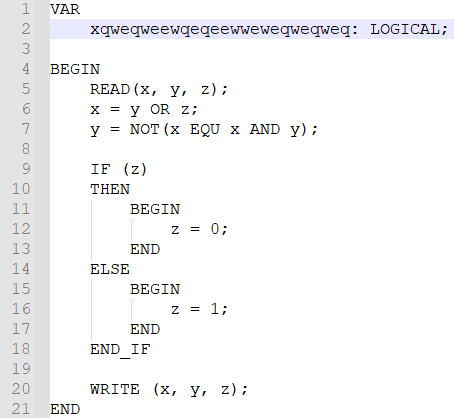

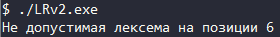

<br/>

**6. Некорректная программа, использование необъявленной переменной**  
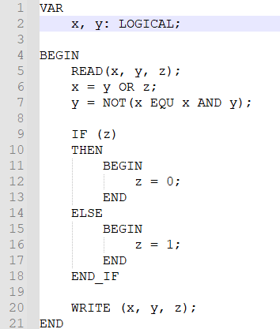

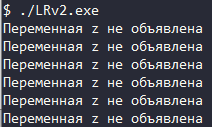

<br/>

**7. Некорректная программа, пропущена открывающая скобка**  
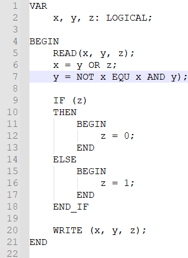

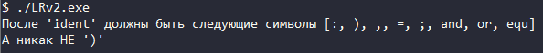

<br/>

**8. Некорректная программа, пропущена необходимая лексема**  
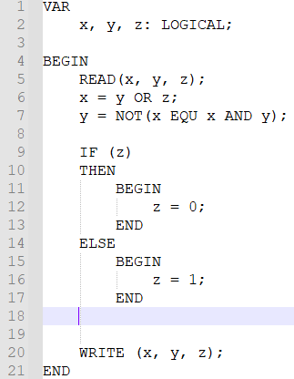

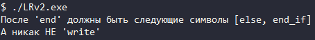